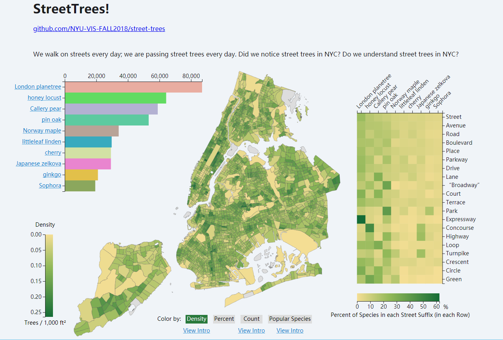

# StreetTrees!

## About

In this project, I tell the story of street trees in NYC, by visualizing multiple features of street trees and their relationship with species, location and street suffixes.

[DEMO](https://phesoca.com/street-trees/)

## Data Set

[2015 Street Tree Census](https://data.cityofnewyork.us/Environment/2015-Street-Tree-Census-Tree-Data/uvpi-gqnh) is conducted by volunteers and staff organized by NYC Parks & Recreation and partner organizations. In the data set, there are tree data collected includes tree species, diameter and perception of health.

## Files

[`screenshot.png`](screenshot.png): the screenshot of the project.

[`d3.js`](d3.js): [D3](https://d3js.org/), v5.7.0.

[`func.js`](func.js): all JavaScript functions for this project using d3.

[`func2.js`](func2.js): all JavaScript functions for this project without d3.

In [`data`](data),

[`tracts.geo.json`](data/tracts.geo.json): the shape data of the census tract, a geographic division used by the U.S. Census. It can be found at [2010 Census Tracts](https://data.cityofnewyork.us/City-Government/2010-Census-Tracts/fxpq-c8ku) (to download, see "Export").

[`num_by_ct.csv`](data/num_by_ct.csv): number of street trees in each census tract, divided into 5 status categories (fair, good, poor, deap, stump).

[`num_by_spc.csv`](data/num_by_spc.csv): number of street trees of each species, divided into 5 status categories.

[`num_by_spc&st.csv`](data/num_by_spc&st.csv): number of street trees of each species and street suffix.

[`pct_by_st.csv`](data/pct_by_st.csv): percent of species in each street suffix.

[`pop_by_ct.csv`](data/pop_by_ct.csv): popular species in each tract.

All `.csv` files are extracted/processed by Tableau from the original data set, so that the data is easier for D3 to read.
